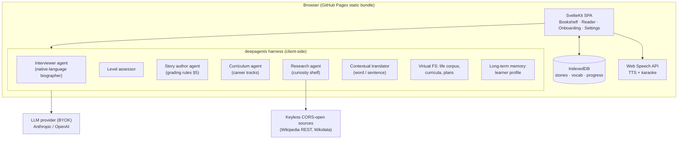

# Build "Dastan" (داستان) — a personal graded-reading app for language learners

You are building a complete, production-quality web application. Read this entire brief before writing any code. Follow the milestones in order and stop for my review at the end of each milestone.

---

## 1. What this app is

Dastan turns a learner's own life and interests into their language textbook.

The first user is me: a Farsi-speaking accountant who immigrated to the US and is improving her English for job interviews. But nothing may be hardcoded to Farsi or English — the app is built around a `nativeLanguage` / `targetLanguage` pair so it later works for French, German, or any pair.

The app has three "bookshelves":

1. **My Story** — During onboarding, an AI interviewer talks with the learner **in their native language** (Farsi for me), like a warm biographer: childhood, family, career, why they emigrated, dreams. It also estimates the learner's current English level from a short playful check. It then writes a personal book of short stories about the learner's own life — and **the author agent decides how many**. The count depends on how rich the corpus is: a thin five-page corpus might honestly make 8–10 stories; a generous one, 25 or more. Never pad to hit a number — every story must earn its place. The book starts extremely easy (a near-zero beginner could read Story 1) and grows harder, ending with the rich, fluent version of their life story. Because the learner already knows the meaning — it's their life — all attention goes to how English expresses it. This shelf also directly rehearses the interview question "tell me about yourself."
2. **My Career** — The learner asks for a domain track, e.g. "accounts payable." A curriculum agent plans the 30–50 English terms that live around that topic and writes a sequence of stories that teach the terms **inside narratives** (a vendor calls about an unpaid invoice…), not as definitions. New stories keep reusing recently learned words until the word set is mastered.
3. **Curiosity** — The learner types any topic; a research agent gathers real facts (see §6.5) and writes a story about it at the learner's current level. Finishing a story offers "one more about this."

Everywhere in the app, while reading:
- **Tap a word** → popup with the meaning **in this sentence's context** in the native language (not a dictionary lookup — "interest" in an accounting story must translate as بهره/سود, not "hobby"). The tap also records the word into the learner's vocabulary list.
- **Long-press / tap the ¶ mark of a sentence** → full sentence translation.
- **Play button** → text-to-speech reads the story aloud with **karaoke word highlighting** (current word highlighted as it is spoken).
- Finishing a story advances progress; the next story unlocks.

The app watches taps to auto-calibrate difficulty: many taps per story → next story generates easier; near-zero taps → level up. The learner never self-rates.

---

## 2. Hard constraints (non-negotiable)

- **Static site only. No server, no backend, no serverless functions, no proxies.** Deploys to **GitHub Pages**.
- **SvelteKit** with `@sveltejs/adapter-static`, SPA mode (`fallback: '404.html'` for Pages routing), `paths.base` set from the repo name via env so it works at `https://<user>.github.io/<repo>/`.
- **TypeScript end to end.** No Python anywhere.
- **Agent harness: `deepagents` (deepagents.js / LangChain / LangGraph), running entirely client-side in the browser.** Use its real capabilities where they fit: planning, virtual file system for the life corpus and curricula, long-term memory for the learner profile, human-in-the-loop approval before a whole book is generated. If a specific deepagents feature cannot run in the browser, fall back to a plain LangGraph.js graph for that piece — but the harness must remain the architecture, not a thin `fetch` wrapper.
- **Bring-your-own API key (BYOK).** The only credential in the system is the learner's own LLM key, entered in Settings, stored in `localStorage`, never transmitted anywhere except the provider. Support **both**:
  - **Anthropic** — browser calls require the header `anthropic-dangerous-direct-browser-access: true` (the official TypeScript SDK exposes `dangerouslyAllowBrowser: true`). Default model `claude-sonnet-4-6`; make the model string editable in Settings.
  - **OpenAI** — SDK with `dangerouslyAllowBrowser: true`; model string editable.
  Build a tiny provider abstraction so LangChain's `ChatAnthropic` / `ChatOpenAI` are interchangeable.
- **Persistence: IndexedDB** (use the `idb` package) for profile, life corpus, stories, vocabulary, and progress. `localStorage` only for settings + key. Include Export/Import of all data as a single JSON file (Settings screen) — the learner must never be able to lose her book.
- **Speech: Web Speech API only.** `speechSynthesis` for TTS with word-boundary highlighting via `SpeechSynthesisUtterance` `boundary` events (`charIndex`). Voice-input for onboarding is optional and behind a feature flag (Farsi speech recognition support is unreliable); typing is the default.
- **No analytics, no trackers, no external calls** other than the LLM provider, Google Fonts, and the keyless research sources in §6.5.

---

## 3. Architecture



---

## 4. Data model (TypeScript, stored in IndexedDB)

```ts
interface LearnerProfile {
  name: string;
  nativeLanguage: string;      // BCP-47, e.g. "fa"
  targetLanguage: string;      // e.g. "en"
  level: number;               // 1–20, continuously recalibrated
  interests: string[];
  createdAt: string;
}

interface LifeCorpus {          // written by the interviewer agent, native language
  sections: { title: string; content: string }[];   // childhood, career, migration…
  updatedAt: string;
}

type Shelf = 'my-story' | 'my-career' | 'curiosity';

interface Story {
  id: string;
  shelf: Shelf;
  trackId?: string;            // for career/curiosity sequences
  seq: number;                 // position in its book/track
  level: number;               // 1–20 at generation time
  title: string;
  titleNative: string;
  body: string;                // target language, paragraphs
  targetWords: string[];       // the 3–8 new words this story teaches
  glossary: Record<string, string>;   // targetWord -> native meaning in this story
  status: 'locked' | 'available' | 'reading' | 'finished';
  tapCount: number;            // taps recorded while reading — calibration signal
  finishedAt?: string;
}

interface VocabEntry {
  word: string;                // lemma, target language
  firstContext: string;        // the sentence it was first tapped in
  meaningNative: string;       // contextual translation at first tap
  taps: number;                // times the learner asked for it
  exposures: number;           // times it appeared in stories since
  status: 'new' | 'learning' | 'known';   // new→learning after first reuse; →known after 4 exposures with 0 further taps
  lastSeenAt: string;
}

interface Track {              // a career or curiosity sequence
  id: string;
  shelf: Shelf;
  topic: string;               // "accounts payable"
  termPlan: string[];          // curriculum agent's 30–50 terms
  storyIds: string[];
  done: boolean;
}
```

Calibration rule (implement exactly): after each finished story compute `tapRate = tapCount / wordCount`. If `tapRate > 0.06` → `level -= 1` for the next generation; if `tapRate < 0.015` → `level += 1`; clamp 1–20. Show the learner nothing about this except a gentle "we'll make the next one a bit easier/harder."

---

## 5. The grading ladder (the heart of the app)

Every story-writing prompt must embed the rules for its level. Anchor levels — interpolate linearly between them:

| Level | Vocabulary allowed | Grammar | Max sentence | Story length | New target words |
|---|---|---|---|---|---|
| 1 | ~300 most common target-language words + learner's name + place names | present simple only, no clauses | 7 words | 100–150 words | 3 |
| 5 | ~600 common words | + past simple, "because", "but" | 10 words | 200–250 | 5 |
| 10 | ~1,200 | + future, comparatives, one relative clause per paragraph | 14 words | 300–400 | 6 |
| 15 | ~2,500 | + present perfect, conditionals, passive | 18 words | 450–550 | 7 |
| 20 | unrestricted natural prose | everything, idioms introduced gently | — | 600–800 | 8 |

Global authoring rules, all levels:
- Bold every **target word** on first appearance; the story ends with a small glossary (target word → native-language meaning *as used in this story*).
- Reuse: each story must naturally include at least 60% of the learner's current `learning`-status words, and every `new` word from the previous story in the same track. Pass the current vocab list into the generation prompt.
- Stories are **stories** — a character, a small tension, a resolution. Never listy exposition, never definitions. In My Story, the character is the learner, told in first person ("I"), because these are the exact sentences she will one day say aloud about herself.
- My Story arc, for whatever count N the author chooses: open with identity and family in present tense; then childhood and school (past tense arrives exactly when the ladder allows it); then career and the decision to emigrate; then arrival, struggle, and first wins; the final story is always the full told-at-dinner version. Same life, told N times, each time richer. Each story must bring new material or new depth — if the author cannot make the next story genuinely fresh, the book is simply shorter; if the corpus sparks more ideas, it is longer.
- Difficulty across the book: spread levels evenly from the learner's assessed starting level up to 20 across the N stories (the per-story calibration in §4 still adjusts on top of this).
- Career-track stories are workplace fiction: small companies, deadlines, a mistake found and fixed — the terms must *do things* in the plot.
- Generation flow for a whole book/track: author agent drafts an outline → **human-in-the-loop approval gate** (deepagents interrupt) shows the learner the planned titles in both languages, including the count — she can ask to trim, merge, or extend before approving → on approval, generate stories 1–3 immediately and the rest lazily as the learner advances (keeps cost and wait low).

Include, verbatim in the codebase as versioned prompt files (e.g. `src/lib/agents/prompts/*.ts`): the interviewer system prompt, the level-assessment prompt, the story-author prompt template, the curriculum prompt, the research-story prompt, and the contextual-translation prompt. Write them carefully — they are the product. The interviewer prompt must specify: speak only the native language, one question at a time, follow up like a biographer, ~15–25 questions across life chapters, then summarize each chapter back for confirmation before saving to the corpus.

Contextual translation prompt contract: input = word + full sentence + native language; output = strict JSON `{ "meaning": "...", "partOfSpeech": "...", "note": "..." }` where `note` is one short line only when the word is being used in a non-obvious sense. Cache results per (word, sentence) in IndexedDB.

---

## 6. Screens

Mobile-first (she reads on her phone), responsive up.

1. **Onboarding** — full-screen chat with the interviewer, native-language UI text, RTL layout when native language is RTL. Progress dots for life chapters. Ends with the approval gate showing the planned story titles.
2. **Bookshelf (home)** — three shelves. Each story is a small book **spine**; finished spines fill with color, the current one glows softly. This screen is the learner's visible progress and pride. A "+" on every shelf: on Career and Curiosity it starts a new track; on My Story it asks the author agent for one more story about any life chapter the learner picks — adding a story must always be this easy.
3. **Reader** — the sanctuary. One story, book-like page, generous margins, adjustable text size, light/sepia/night themes. Tap-word popup (word, contextual meaning, small speaker icon to hear just that word, "got it"). Sentence translation on ¶ tap. Sticky bottom bar: play/pause karaoke TTS, speed 0.7×/1×/1.25×, progress. "Finish story" at the end → tiny celebration → next spine unlocks.
4. **Words** — the vocabulary list grouped by status (new / learning / known), each with its first context sentence and meaning; tap to hear. No quizzes in v1 — exposure through stories is the mechanism.
5. **Settings** — provider (Anthropic/OpenAI), API key (password field, stored locally, with a one-line explanation that the key never leaves the browser except to the provider), model string, native/target language pair, TTS voice picker, text-size default, data Export/Import, "Start over" with double confirmation.
5b. **First-run empty state** — before any key is entered, the bookshelf shows one built-in sample story (ship it in the bundle, level 3, about a small bakery's ledger) so the app demos instantly without a key.

---

## 7. Design direction

This must feel like a beloved book, not software. Aesthetic ground: **Persian illuminated manuscripts** — it's the learner's heritage and the app's soul.

- Palette: ivory paper `#F7F2E7`; ink `#22252B`; **lapis** `#1F4E8C` as primary (Persian miniature ultramarine); **saffron** `#D9A036` for progress/gold accents only; night theme `#14161C` paper with `#D8D3C4` ink. No terracotta, no gradients-with-big-numbers hero.
- Type: **Literata** for target-language reading text (it is designed for long-form e-reading; use its optical sizes); **Vazirmatn** for Farsi/RTL text everywhere; system sans for utility labels. Reading page: 17–19px base, 1.7 line-height, ~65ch measure on desktop.
- Signature element: the **bookshelf spines** — each spine gets a thin illuminated border pattern (subtle SVG, tazhib-inspired, lapis + saffron) that completes as the story is finished. Spend the design boldness here; keep the reader page austere and calm.
- Motion: one place only — the spine fill on finishing a story. Respect `prefers-reduced-motion`.
- Full RTL correctness: the app chrome follows the *native* language direction on onboarding/settings; the reader page follows the *target* language direction; mixed-direction popups must not break.
- Accessible: visible focus states, real buttons, popups reachable by keyboard, TTS controls labeled.

---

## 8. Deployment — GitHub Actions → GitHub Pages

Create `.github/workflows/deploy.yml`:

```yaml
name: Deploy to GitHub Pages
on:
  push:
    branches: [main]
  workflow_dispatch:
permissions:
  contents: read
  pages: write
  id-token: write
concurrency:
  group: pages
  cancel-in-progress: true
jobs:
  build:
    runs-on: ubuntu-latest
    steps:
      - uses: actions/checkout@v4
      - uses: actions/setup-node@v4
        with: { node-version: 22, cache: npm }
      - run: npm ci
      - run: npm run build
        env:
          BASE_PATH: /${{ github.event.repository.name }}
      - uses: actions/upload-pages-artifact@v3
        with: { path: build }
  deploy:
    needs: build
    runs-on: ubuntu-latest
    environment:
      name: github-pages
      url: ${{ steps.deployment.outputs.page_url }}
    steps:
      - id: deployment
        uses: actions/deploy-pages@v4
```

`svelte.config.js` must read `BASE_PATH` into `kit.paths.base` (empty in dev). Verify the built site works under the subpath (assets, router, fonts) and that deep links reload correctly via the `404.html` fallback.

---

## 9. Milestones (stop for my review after each)

**M1 — Skeleton + Reader.** SvelteKit static scaffold, theming/design system, Settings with BYOK provider abstraction (test call button), IndexedDB layer, the bundled sample story readable end-to-end: tap-to-translate (live LLM call), sentence translation, karaoke TTS. Deploy workflow green on Pages.
**M2 — My Story.** Interviewer agent with RTL chat UI, level assessment, corpus in the harness VFS, outline + approval gate, lazy generation of the book, calibration loop, bookshelf with spines, vocabulary list with statuses and reuse wired into generation.
**M3 — Career + Curiosity.** Curriculum agent and track creation flow; research agent using keyless CORS-open sources only — **Wikipedia REST API and Wikidata** (both keyless and CORS-open; do not add sources that need keys or proxies) — with the story clearly separating fact-based content from invented narrative; "one more about this" continuation; Export/Import; polish pass (empty states, error states with plain-language messages, loading states that never block reading something already generated).

**Definition of done, whole app:** a brand-new user with only an Anthropic key can, on the deployed Pages URL, complete a Farsi onboarding, approve her book, read Story 1 with taps and audio, finish it, and see Story 2 unlock at an adjusted level — with no console errors and no requests to anything but the provider, fonts, and Wikipedia.

## 10. Do not

- Do not add a server, proxy, edge function, or any second credential.
- Do not use a dictionary API for translation — context via the LLM only.
- Do not hardcode Farsi/English strings in components; all UI text through a small i18n map (`fa`, `en` to start).
- Do not generate the whole book upfront; outline first, approve, then lazy-generate.
- Do not fix the story count at any number; the author agent chooses it from the corpus, and the learner can change it at the approval gate.
- Do not ship any placeholder lorem content; every visible string is real.
